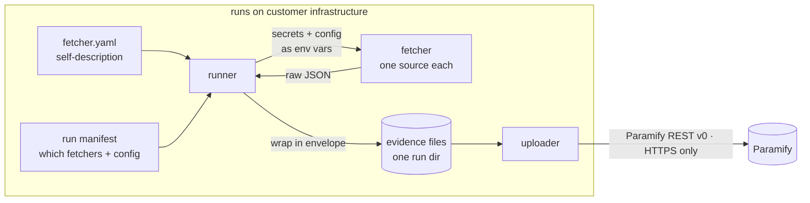

[](https://deepwiki.com/paramify/paramify-fetchers)


# Paramify Fetchers

Fetchers are small scripts that collect compliance evidence from your infrastructure and write it to disk as JSON. A separate uploader stage pushes that evidence to Paramify. This repo contains the fetchers, the runner that executes them, and the uploader — the fetchers themselves never talk to Paramify directly.

```
  customer tool  ──fetcher──▶  JSON evidence file  ──uploader──▶  Paramify
                               (on disk, per run)     (separate stage)
```

The `paramify` CLI is the way in — list the catalog, then inspect any one
fetcher's contract:


---

## Quick start

**Prerequisites:** Python 3.10+. The CLIs your fetchers need (`aws`, `jq`, `curl`, `kubectl`, etc.) must be on your `PATH` — install only what applies to the categories you'll run. Each service's credential setup guide is in `fetchers/<category>/README.md`.

```bash
# 1. Clone and install
git clone https://github.com/paramify/paramify-fetchers.git
cd paramify-fetchers
python -m venv .venv && source .venv/bin/activate   # recommended
pip install -e .
# To add the TUI: pip install -e '.[all]'

# 2. Browse available fetchers by category
paramify catalog

# 3. Start a manifest and wire in your fetchers
paramify manifest init
paramify manifest add okta_phishing_resistant_mfa
paramify manifest set-secret okta_phishing_resistant_mfa api_token OKTA_API_TOKEN
paramify manifest set-secret okta_phishing_resistant_mfa org_url OKTA_ORG_URL
# The manifest builder reports missing secrets after each step —
# keep going until it says the manifest is runnable.

# 4. Set your credentials and run
export OKTA_API_TOKEN=<your token>
export OKTA_ORG_URL=https://your-org.okta.com
paramify validate manifest.yaml
paramify run     manifest.yaml         # evidence → ./evidence/run-<timestamp>/

# 5. Upload to Paramify
export PARAMIFY_UPLOAD_API_TOKEN=<your token>   # see uploaders/paramify_evidence/README.md for setup
paramify upload                                  # push the latest run
```

Use `paramify describe <fetcher>` to see exactly what secrets and config any fetcher needs. Each service has a credential setup guide in its fetcher directory — for example, [`fetchers/okta/README.md`](fetchers/okta/README.md) covers creating an Okta API token and the required admin role. See [`examples/`](examples/) for complete worked manifests (multi-region AWS, GitLab fanout, etc.) and [`deploy/README.md`](deploy/README.md) for running on a schedule in Docker or Kubernetes.

---

## Supported services

<div align="center">

<a href="fetchers/aws/"></a>
<a href="fetchers/okta/"></a>
<a href="fetchers/sentinelone/"></a>
<a href="fetchers/knowbe4/"></a>
<a href="fetchers/gitlab/"></a>
<a href="fetchers/k8s/"></a>
<a href="fetchers/rippling/"></a>
<a href="fetchers/checkov/"></a>

</div>

| Category | Fetchers | What it collects | Status |
|---|---:|---|---|
| **AWS** | 79 | Encryption at rest, IAM, high availability, logging, network segmentation — across the AWS service surface | ✅ complete |
| **Okta** | 8 | Phishing-resistant MFA, authenticators, least privilege, just-in-time access, account management | starter set |
| **SentinelOne** | 5 | Agents, activities, cloud detection rules, XDR assets, user config | starter set |
| **KnowBe4** | 4 | Security-awareness, high-risk, developer, and module-based training summaries | starter set |
| **GitLab** | 3 | CI/CD pipeline config, merge-request and project summaries | starter set |
| **Kubernetes** | 3 | EKS pod inventory, microservice segmentation, `kubectl` security posture | starter set |
| **Rippling** | 3 | Employee roster, current employees, managed devices | starter set |
| **Checkov** | 2 | IaC scans over cloned Terraform / Kubernetes source | starter set |

### Coming soon

More integrations are in progress. To request a fetcher or upvote what should be prioritized next, visit [Paramify Community Feature Requests](https://support.paramify.com/hc/en-us/community/topics/31851789568275-Feature-Requests).

<div align="center">


Azure · and more

</div>

---

## How it runs

Four pieces, kept deliberately separate:

- **Fetcher** — a small script (`fetcher.py` or `fetcher.sh`) that collects from
  *one* source and writes a JSON file. It reads everything it needs from
  environment variables and writes only to `EVIDENCE_DIR`.
- **`fetcher.yaml`** — the fetcher's self-description: its name, what secrets and
  config it needs, what it outputs, and its `evidence_set` identity. Ships with
  the code, validated against a schema. Customers never edit this.
- **Run manifest** — the customer's intent: which fetchers to run, with what
  config, against what targets. Lives in the customer's environment, not here.
- **Runner** — reads `fetcher.yaml` files and a manifest, resolves secrets and
  config into environment variables, and executes each fetcher.



Everything goes through one facade, `framework.api` — discovery, manifest
editing, validation, and running. One CLI, `paramify`, sits on top of it and
steers every front-end; because they all share that single code path they behave
identically. Install it once from the repo (editable), then:

```bash
pip install -e .                  # installs the `paramify` command
                                  # (use `pip install -e '.[all]'` to add the TUI)

paramify <cmd>                    # human CLI
paramify <cmd> --json             # same commands, machine-readable (for AI/scripts)
paramify tui                      # interactive terminal UI
```

> Back-compat: `python -m framework.runner <cmd>` and `python -m framework.tui`
> still work and are exactly equivalent to the corresponding `paramify`
> subcommands.

`paramify tui` drives that same facade interactively — browse the catalog, build
and validate a manifest, run it, and review evidence without leaving the keyboard:


The CLI command surface:

```bash
paramify list                  # discovered fetchers (flat)
paramify catalog               # categories → fetchers → editable fields
paramify describe <fetcher>    # one fetcher's config / secrets / target fields
paramify manifests             # discovered run manifests (manifests/*.yaml)
paramify validate <manifest>   # validate a manifest without running
paramify run      <manifest>   # run it
paramify runs                  # past runs under an output dir (newest first)
paramify evidence <file>       # read one evidence file (normalizing the envelope)
paramify upload   [run-dir]    # push a run's evidence to Paramify (default: latest run)
paramify manifest <sub>        # build/edit a manifest (see below)
```

Output lands in `<output_dir>/run-<UTC-timestamp>/`, one JSON file per fetcher
(or per target for fan-out), alongside a `_run_metadata.json` run index. The
runner wraps each evidence file in an envelope —
`{schema_version, metadata, payload}` — where `metadata` carries the fetcher
name/version/category, run id, target, `collected_at`, status, exit code, and
the `evidence_set` identity; failed invocations also get a `stderr_tail`. The
`_run_metadata.json` index itself is not enveloped.

A finished evidence file looks like this — an AWS VPC-segmentation run,
abbreviated:

```json
{
  "schema_version": "1.0",
  "metadata": {
    "fetcher_name": "aws_vpc_network_segmentation",
    "fetcher_version": "0.1.0",
    "category": "aws",
    "run_id": "2026-06-16T15-56-41Z",
    "target": { "region": "us-east-1" },
    "collected_at": "2026-06-16T16:00:14Z",
    "status": "success",
    "exit_code": 0,
    "evidence_set": {
      "reference_id": "EVD-VPC-SEGMENTATION",
      "name": "VPC Network Segmentation",
      "instructions": "Script: fetcher.sh. Commands: aws ec2 describe-vpcs, describe-subnets, describe-vpc-peering-connections, describe-vpc-endpoints. Maps to KSI-CNA-03.",
      "description": "Lists VPCs, subnets, peering connections, and endpoints to document network topology and segmentation."
    }
  },
  "payload": {
    "metadata": { "account_id": "111122223333", "region": "us-east-1", "datetime": "2026-06-16T16:00:14Z" },
    "results": [
      { "ResourceType": "Vpcs", "Items": [
        { "VpcId": "vpc-0a1b2c3d", "CidrBlock": "172.31.0.0/16", "IsDefault": true, "State": "available" }
      ] },
      { "ResourceType": "Subnets", "Items": [
        { "SubnetId": "subnet-0d7e6de0", "VpcId": "vpc-0a1b2c3d", "CidrBlock": "172.31.80.0/20", "AvailabilityZone": "us-east-1b" }
      ] }
    ]
  }
}
```

The runner owns the `metadata` envelope; the fetcher owns `payload`. The
`evidence_set` block (from `fetcher.yaml`) is what an uploaded file maps to in
Paramify. Note there is no pass/fail verdict — that judgment is Paramify-side, by
design (peering connections and endpoints are omitted above for brevity).

### Building a manifest

`paramify manifest <sub>` edits a manifest file in place (`-f/--file`, default
`./manifest.yaml`). It reads each `fetcher.yaml` and warns which secrets and
config are still missing until the manifest is runnable.


```bash
paramify manifest init [--output-dir DIR]            # start a manifest at -f/--file
paramify manifest new <name> [--output-dir DIR]      # create manifests/<name>.yaml
paramify manifest add <fetcher>                      # add a fetcher
paramify manifest remove <fetcher>
paramify manifest set-config <fetcher> key=value
paramify manifest set-secret <fetcher> <secret_name> <ENV_VAR>
paramify manifest add-target <fetcher> k=v ... [--secret name=ENV_VAR ...]
paramify manifest remove-target <fetcher> <index>
paramify manifest set-platform-config <category> key=value
paramify manifest set-passthrough <category> ENV_VAR ...
paramify manifest set-output-dir <dir>
paramify manifest show [--json]
```

Every `manifest` subcommand also accepts `--json`, emitting a stable
`{"ok", "path", "errors"}` object — so an agent can build a manifest step by step
and read `errors` to see what's still missing.

### Collect, then upload

Collection and upload are separate stages on purpose. The runner only collects;
pushing to Paramify is a second step, run against the enveloped run directory:

```bash
paramify run manifest.yaml          # collect → enveloped JSON in run-<ts>/
paramify upload                     # upload the latest run (get-or-create evidence
                                    # set by reference_id, multipart artifacts)
```

`paramify upload` takes an optional run directory (default: the latest run under
`--output-dir`) and supports `--dry-run`, `--config`, and `--json`; the same
uploader can also be invoked directly as
`python -m uploaders.paramify_evidence <run-dir>`. It is idempotent within a run,
talks Paramify REST v0 over HTTPS only, and reads `PARAMIFY_UPLOAD_API_TOKEN`
(with optional `PARAMIFY_API_BASE_URL`). See
[`uploaders/paramify_evidence/README.md`](uploaders/paramify_evidence/README.md)
for how to create a Paramify API key with the required permissions. Chaining the two stages is the
customer's job, not the runner's; `run_and_upload.sh` at the repo root is
example glue.

---

## Why the design is strict

Every fetcher is forced through one contract, validated by JSON Schema, with a
narrow set of allowed shapes. That rigidity is intentional. The previous
generation of fetchers were freeform scripts, and each one invented its own
conventions for config, secrets, and output — which is exactly why none of them
composed and the central catalog had to be hand-maintained in sync. A few
principles keep that from happening again:

- **One contract, schema-enforced.** A fetcher declares itself in `fetcher.yaml`,
  validated at discovery time. Anything not in the schema is not a thing a
  fetcher can do. This is what lets the runner treat all 107 fetchers identically.
- **Fetchers run on customer infrastructure**, never Paramify's. So a fetcher
  never assumes a Paramify connection, and the framework owns no scheduling.
- **Secrets are source-agnostic.** A fetcher reads `OKTA_API_TOKEN` from the
  environment. It never knows or cares whether that came from a `.env` file,
  AWS Secrets Manager, Vault, or a CI secret block — because every one of those
  already knows how to set an environment variable. We do not write per-provider
  secret integrations, and we don't intend to.
- **Collect facts; interpret elsewhere.** A fetcher gathers evidence. Whether
  that evidence *satisfies* a control is a Paramify-side mapping, not the
  fetcher's job. Keep pass/fail verdicts and compliance thresholds out of
  fetchers.
- **One source per fetcher.** Cross-source comparison (e.g. Okta users vs.
  Rippling employees) is a separate "comparator" that reads prior outputs — same
  contract, different inputs. A fetcher never reads another fetcher's output.

The full contract is in [`docs/fetcher_contract.md`](docs/fetcher_contract.md);
the rationale is in [`docs/design.md`](docs/design.md).

> **Status:** pre-1.0 (v0.x). The runner now wraps every output in the
> `metadata`+`payload` envelope, but fetchers still write raw evidence dicts and
> read env directly rather than receiving a typed secrets object — both are
> tracked interim shortcuts, not the target. Comparators (`depends_on`),
> the `paramify_issues` uploader, and structured exit-code categories (still
> binary `0`/`1`, plus `124` for a runner timeout-kill) are not built yet. See
> `docs/design.md` for what's deferred.

---

## Repository layout

```
framework/                      # shared code (facade, runner, contract, schemas)
  api.py                        # the facade — discovery, manifest edit, validate, run
  schemas/                      # fetcher / manifest / category JSON Schemas
  cli.py                        # the `paramify` CLI — one command, steers every front-end
  runner/                       # executor + manifest loader (+ `python -m framework.runner` shim)
  tui/                          # terminal UI front-end (Textual)
fetchers/
  _categories/<name>.yaml       # platform-wide config + auth for a category
  _template/                    # copy this to start a new fetcher
  <category>/
    README.md                   # credential setup guide for this service
    _shared/                    # code shared across fetchers in this category
    <short_name>/               # one directory per fetcher
      fetcher.yaml
      fetcher.py | fetcher.sh
comparators/                    # cross-source comparators (template only so far)
uploaders/
  paramify_evidence/            # push evidence to Paramify (built)
  paramify_issues/              # stub, not built yet
examples/                       # sample run manifests
tests/                          # framework test suite (pytest)
manifest.yaml                   # working manifest at repo root
run_and_upload.sh               # example collect→upload glue
docs/                           # contract, design, and reference guides
```

Directories starting with `_` are not fetchers — the runner skips them.

---

## Adding a fetcher

To add evidence collection for a new control or a new tool, see [`docs/authoring_a_fetcher.md`](docs/authoring_a_fetcher.md).

---

## Where to read next

| Doc | What it covers |
|---|---|
| [`fetchers/aws/README.md`](fetchers/aws/README.md) | AWS credential setup (ambient + multi-account fanout) |
| [`fetchers/okta/README.md`](fetchers/okta/README.md) | Okta API token + required admin role |
| [`fetchers/gitlab/README.md`](fetchers/gitlab/README.md) | GitLab project access token setup |
| [`fetchers/sentinelone/README.md`](fetchers/sentinelone/README.md) | SentinelOne service user + API token |
| [`fetchers/knowbe4/README.md`](fetchers/knowbe4/README.md) | KnowBe4 Reporting API key |
| [`fetchers/rippling/README.md`](fetchers/rippling/README.md) | Rippling Developer Hub token + scopes |
| [`fetchers/k8s/README.md`](fetchers/k8s/README.md) | Kubernetes / EKS credential setup |
| [`fetchers/checkov/README.md`](fetchers/checkov/README.md) | Checkov setup + git token for IaC scanning |
| [`uploaders/paramify_evidence/README.md`](uploaders/paramify_evidence/README.md) | Paramify API key setup + upload options |
| [`docs/authoring_a_fetcher.md`](docs/authoring_a_fetcher.md) | Writing a new fetcher from scratch |
| [`docs/fetcher_contract.md`](docs/fetcher_contract.md) | The binding runner↔fetcher contract |
| [`docs/run_manifest_reference.md`](docs/run_manifest_reference.md) | Manifest format reference |
| [`docs/config_injection_design.md`](docs/config_injection_design.md) | Platform/config/auth model |
| [`docs/design.md`](docs/design.md) | Why the framework is shaped this way + current state of the work |
